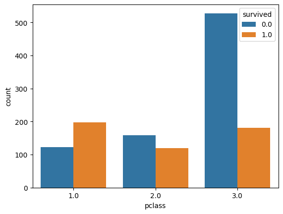
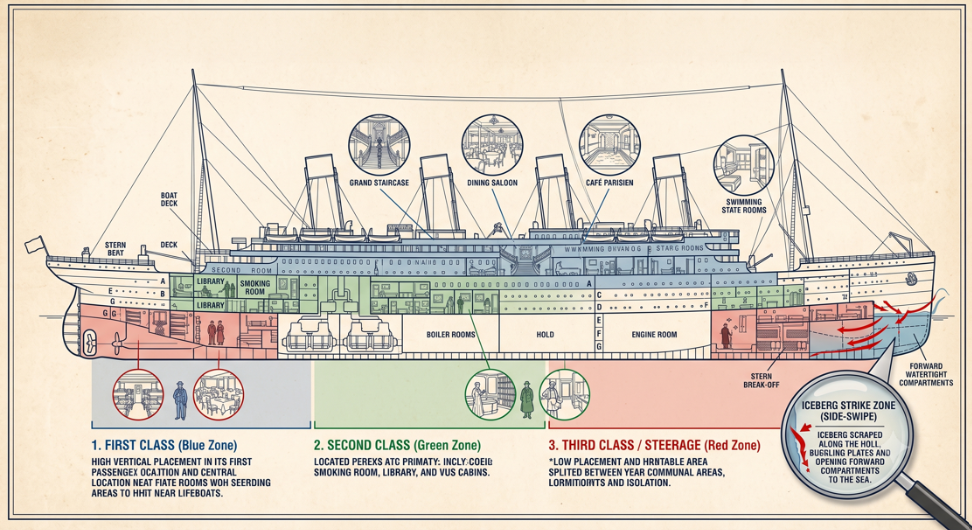

# Titanic Dataset: Contextual & Spatial EDA

> **Project Goal:** Moving beyond standard statistical summaries to extract historical, spatial, and social constraints from the Titanic dataset for downstream choice-based game mechanics and contextual ML models.

---

### Key Narrative Insights & Feature Engineering

1. **Spatial Vulnerability (Class vs. Deck Placement)**
   * **Finding:** 3rd Class passengers faced ~70% mortality.
   * **Context:** First-class cabins were near the boat deck; third-class/steerage was at the bottom/stern. Physical distance to lifeboats dictated survival before decision-making even began.

2. **The "Solo Male" Casualty Spike**
   * **Feature Created:** `ptype` (`Individual` vs. `Family`).
   * **Finding:** Solo travelers suffered massive casualty rates, overwhelmingly male, while traveling with family significantly increased survival odds for women/children due to social/evacuation protocols.

---

### Key Visualizations

---

### Tech Stack & Methods
* **Analysis:** Python (`pandas`, `numpy`)
* **Visualization:** `seaborn`, `matplotlib`
* **Feature Engineering:** Binning age brackets, merging relational metadata, engineered `ptype` (Individual/Family split).